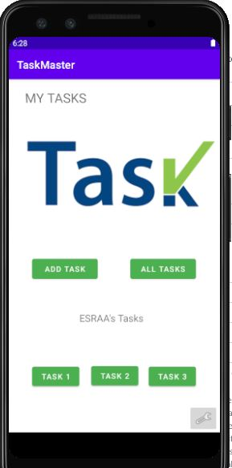
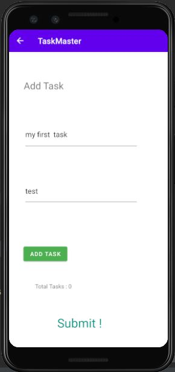
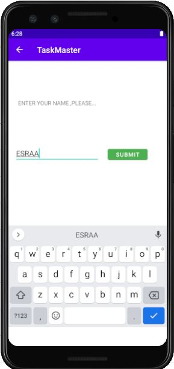
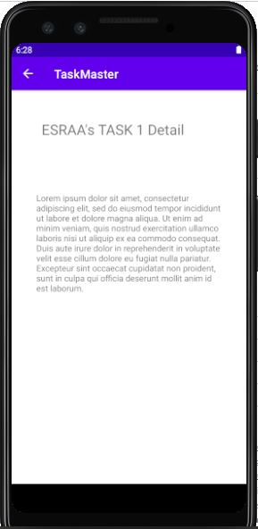

# taskmaster
## Lab: 26 - Beginning TaskMaster
- **Homepage**
  create a `main activity` ,which allows the user to move either to add task `activity` or `all tasks` activity 
- **Add a Task**
  - create a `Add a Task activity` ,which allows the user to type in details about a new task.
  - When users click the “submit” button, show a “submitted!” label on the page.
- **All Tasks**
create an `all tasks activity` should just be an image with a back button .
#
## Lab: 27 - Data in TaskMaster
- **Homepage**
   - update the `main activity` by adding three buttons for several tasks,which allows the user to select any task and show its details in `Details activity`.
   - Add a setting button which allows the user move to `setting activity`.
- **Details**
  - create a `Details activity` ,which for now has only a title of individual task for the user .
  - Also has a details of that task -for now its a "Lorem Ipsum text"- .
- **Setting**
   - create a `setting activity` , which allows the user to add her/his name which shown up on both of `main` and `details` activities. which allows the user .
# Lab: 28 - RecyclerView
# Lab: 29 - Room
### Wireframes
# 
# 
# 
# 
# 